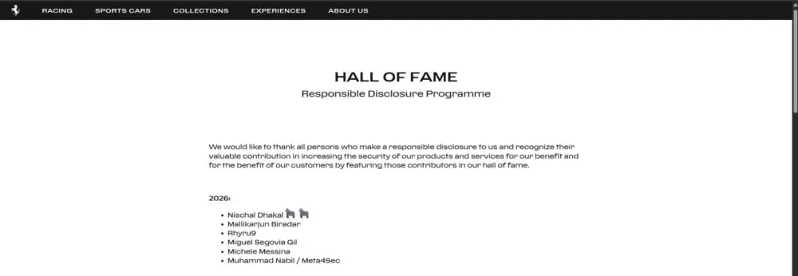

# Ferrari Responsible Disclosure Hall of Fame 2026 — Nischal Dhakal

**Researcher:** Nischal Dhakal  
**Organization:** Ferrari  
**Programme:** Responsible Disclosure Programme  
**Year:** 2026

My name appears in Ferrari's 2026 Responsible Disclosure Programme Hall of Fame. The acknowledgement records a contribution made through responsible security disclosure.

This page is included in my cybersecurity portfolio as evidence of the public recognition. Technical details of the reported issue are intentionally omitted.

## Ferrari Hall of Fame Entry

## Responsible Disclosure Note

This recognition does not imply employment, partnership, sponsorship, or endorsement. Ferrari's names, logos, and trademarks remain the property of their respective owner.
