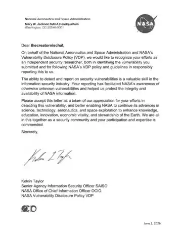

# NASA Vulnerability Disclosure Policy Recognition — Nischal Dhakal

**Researcher:** Nischal Dhakal (`thecreatornischal`)  
**Organization:** National Aeronautics and Space Administration (NASA)  
**Programme:** Vulnerability Disclosure Policy (VDP)  
**Recognition date:** June 1, 2026

NASA provided a letter recognizing my efforts as an independent security researcher. The letter acknowledges the identification of a vulnerability, responsible reporting under NASA's Vulnerability Disclosure Policy, and the value of security research in protecting the integrity and availability of NASA information.

I am publishing the acknowledgement as part of my cybersecurity portfolio. Technical vulnerability details, affected systems, reproduction steps, and confidential communication are intentionally omitted.

## NASA VDP Recognition Letter

## Responsible Disclosure Note

Public recognition does not remove a researcher's responsibility to protect the affected organization and its users. This page records the acknowledgement only.
