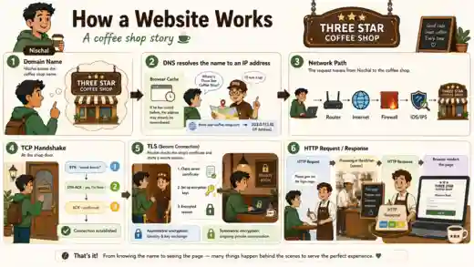

# How a Website Works: DNS, TCP, TLS and HTTP — A Coffee Shop Story



How does a website work? A website can seem simple from the outside: enter a name, press Enter, and a page appears. Behind that small action, several systems work together in a precise order.

To explain the process, imagine that I am trying to visit a place called **Three Star Coffee Shop**. The coffee shop represents the website, and my journey to it represents everything the browser does before showing the page.

> This analogy is intentionally simplified for beginners. Real networks include additional layers, optimizations, caches, security controls, and protocol variations.

---

## 1. The Domain Name — Knowing the Coffee Shop's Name

I know the business as **Three Star Coffee Shop**, but a name alone does not tell me where the shop is physically located.

A website works in the same way. A name such as:

```text
three-star-coffee-shop.com
```

is a **domain name**. It is easy for people to remember, but computers ultimately need a network address to find the correct server.

| Coffee shop story | Web technology |
|---|---|
| Three Star Coffee Shop | Domain name |
| The physical street address | IP address |

---

## 2. DNS — Finding the Address

Before leaving, I need to convert the coffee shop's name into its address. On the web, this job is performed by the **Domain Name System**, or **DNS**.

My browser first checks whether it already knows the answer. The address may be stored in a browser, operating-system, or network cache because I visited the site recently.

When no cached answer is available, a DNS resolver is asked:

> “What IP address belongs to `three-star-coffee-shop.com`?”

The resolver follows the DNS process and returns an address such as:

```text
203.0.113.10
```

The exact value is not important in the story. What matters is that DNS translates a human-friendly name into an IP address that computers can route to.

---

## 3. The Network Path — Travelling to the Coffee Shop

Now I know where to go. My request begins travelling from my device toward the web server.

The route may pass through:

- my computer or phone
- a local router
- my internet service provider
- multiple routers across the internet
- firewalls and other security controls
- the network hosting the destination server

This is the **network path**.

The internet does not carry the request as one giant object. The information is broken into packets, and routers forward those packets toward the destination IP address.

Firewalls may permit or deny traffic according to security rules. Some environments also use monitoring and prevention technologies such as IDS or IPS, although they are not automatically present in every path.

---

## 4. The TCP Handshake — Knock, Reply, Confirm

When I reach the coffee shop, I cannot immediately start ordering. First, I knock and confirm that both sides are ready to communicate.

For common web connections that use TCP, this is the **three-way TCP handshake**:

```text
Client  -> Server: SYN
Server  -> Client: SYN-ACK
Client  -> Server: ACK
```

The coffee shop version sounds like this:

1. **SYN — “Knock, knock. Can we talk?”**
2. **SYN-ACK — “Yes, I am here, and I heard you.”**
3. **ACK — “Confirmed. Let us begin.”**

After these three steps, the TCP connection is established.

TCP provides an ordered and reliable byte stream. It tracks delivery, detects missing data, and retransmits information when necessary.

> Modern HTTP/3 uses QUIC over UDP rather than this TCP handshake, but TCP remains the clearest starting point for understanding traditional HTTPS connections and HTTP/1.1 or HTTP/2.

---

## 5. TLS — Checking Identity and Creating a Private Room

A working connection does not automatically mean that the conversation is private or that I reached the intended server.

For an HTTPS website, the next major process is **TLS**, which stands for **Transport Layer Security**.

In the coffee shop story, I want to confirm that:

- this is genuinely the shop associated with the domain I requested
- the server can prove its identity
- our later conversation cannot easily be read or altered by others

### Certificate validation

The server provides a digital certificate. My browser checks details such as:

- whether the certificate is valid for the requested domain
- whether it is within its validity period
- whether it chains back to a trusted certificate authority
- whether the server can prove possession of the corresponding private key

This is similar to checking the coffee shop's official identity rather than trusting only the sign outside.

### Key agreement

The client and server establish shared session keys. Public-key or asymmetric cryptography helps authenticate the server and securely establish the secrets needed for the session.

The simplest analogy is that the waiter and I agree on a private room and a lock that only our session can use.

### Symmetric encryption

Once the secure session is established, the main application data is protected with **symmetric encryption**.

Symmetric encryption is used because it is efficient for protecting large amounts of ongoing traffic. The same shared session secret allows each side to encrypt and decrypt the conversation.

In the analogy:

- **Asymmetric cryptography** helps verify identity and establish shared secrets.
- **Symmetric cryptography** protects the continuing private conversation.

TLS also provides integrity protection, helping detect whether encrypted data was modified while travelling across the network.

---

## 6. HTTP — Placing the Order

The connection is ready and protected. I can now ask the server for something using an **HTTP request**.

For example, I may ask:

> “Please give me the login page.”

A simplified HTTP request might look like this:

```http
GET /login HTTP/1.1
Host: three-star-coffee-shop.com
```

The request contains information such as:

- the HTTP method, such as `GET` or `POST`
- the requested path
- headers describing the request
- sometimes a body containing submitted data

The web server receives the request and processes it. Depending on the application, it may:

- locate a static file
- run application code
- query a database
- check authentication or authorization
- communicate with another service
- generate a response dynamically

---

## 7. The HTTP Response — Receiving the Order

After processing the request, the server sends an **HTTP response**.

A simplified response begins like this:

```http
HTTP/1.1 200 OK
Content-Type: text/html
```

It includes:

- a status code, such as `200`, `301`, `403`, or `404`
- response headers
- a response body

For a web page, the body may contain HTML. The HTML can then reference additional resources such as:

- CSS stylesheets
- JavaScript files
- images
- fonts
- API endpoints

The browser may send more HTTP requests to retrieve these resources.

So the page is not always delivered as one complete package. It is often assembled from many responses.

---

## 8. The Browser Renders the Page

The browser interprets the returned content and turns it into the visual page displayed on the screen.

At a high level, it:

1. parses the HTML to understand the document structure
2. loads and applies CSS rules
3. downloads and executes JavaScript where required
4. calculates the page layout
5. paints the final content on the screen

In the coffee shop analogy, the kitchen and staff prepare the order, package it correctly, and present it in a form I can use.

---

## 9. What Happens After the First Page Loads?

Once a secure connection exists, the browser and server can exchange more HTTP requests and responses.

For example:

- clicking **Log in** sends credentials or an authentication request
- opening a profile requests account information
- loading a dashboard may trigger several API requests
- submitting a form sends new data to the server

Connections may be reused instead of creating a completely new connection for every resource. Modern protocols also allow multiple requests to be handled efficiently over the same secure connection.

---

## Complete Mapping of the Story

| Coffee shop story | What it represents |
|---|---|
| Knowing “Three Star Coffee Shop” | Domain name |
| Looking up its physical address | DNS resolution |
| Remembering a previous address | DNS or browser/OS cache |
| Travelling across roads | Network routing |
| Security checkpoints on the route | Firewalls and network security controls |
| Knocking at the door | TCP SYN |
| The shop replying | TCP SYN-ACK |
| Confirming the conversation | TCP ACK |
| Checking the official identity | TLS certificate validation |
| Agreeing on a private room and lock | Cryptographic key agreement |
| Speaking privately | Symmetric encryption |
| Asking for the login page | HTTP request |
| Kitchen processing the order | Server-side processing |
| Receiving the prepared order | HTTP response |
| Arranging everything for presentation | Browser rendering |

---

## Final Summary

When a user enters a website address, the browser typically performs a chain of actions:

```text
Domain name
    -> DNS resolution
    -> network routing
    -> TCP connection
    -> TLS-secured session
    -> HTTP request
    -> server processing
    -> HTTP response
    -> browser rendering
```

What looks like one click is actually a coordinated process involving naming systems, routing, transport protocols, encryption, application protocols, servers, and browser engines.

That is how knowing the coffee shop's name eventually becomes seeing the finished website on the screen.

---

## Frequently Asked Questions

### What happens when I type a website address into a browser?

The browser resolves the domain name through DNS, connects to the destination server, establishes transport and encryption as required, sends an HTTP request, receives one or more HTTP responses, and renders the returned resources.

### What is DNS in simple terms?

DNS translates a human-readable domain name into an IP address that computers can route to. In the coffee shop analogy, it is the process of finding the shop's physical address from its name.

### What is the TCP three-way handshake?

For TCP-based web connections, the client sends `SYN`, the server replies with `SYN-ACK`, and the client confirms with `ACK`. This establishes the TCP connection before application data is exchanged.

### What does TLS do for HTTPS?

TLS authenticates the server through certificate validation, establishes cryptographic session keys, encrypts data in transit, and protects the integrity of the connection.

### What is the difference between HTTP and HTTPS?

HTTP defines how web requests and responses are exchanged. HTTPS is HTTP carried through a TLS-secured connection, providing authentication, encryption, and integrity protection.
